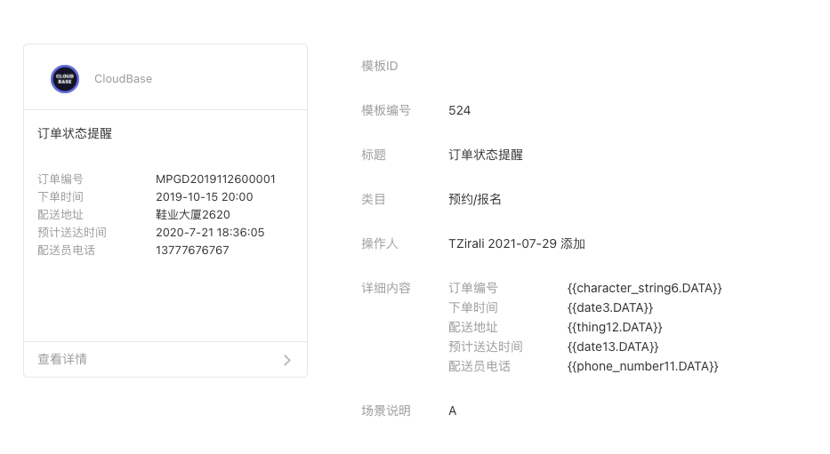
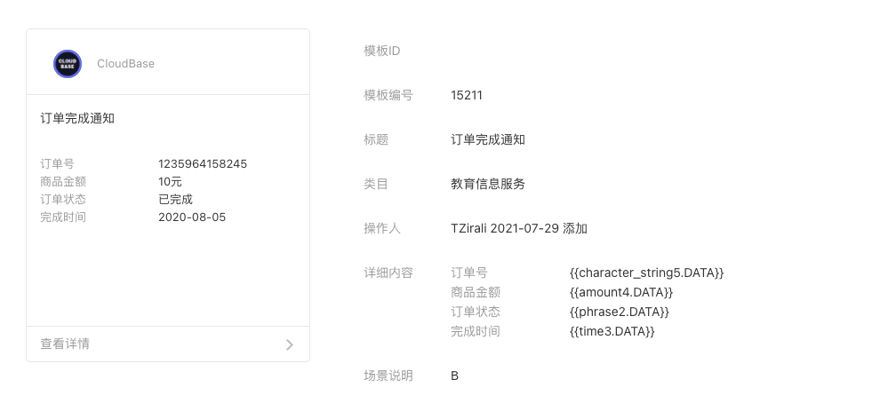

# 【外卖点餐-早餐预定】小程序云开发项目实战

## 项目介绍

- 小程序模拟一个商户对辖区内供应早餐的情景，用户通过在线预定早餐，商户实施配送，直到付款配送完成整个流程。整个流程分为预定中，已确认，已完成3个状态。在预定中状态用户可以取消预定。其他时候用户可以发起客服会话。
- 因为模拟展示，所以没有添加商户端和配送员端，状态变化由时间触发。

## 部署介绍

此处为项目完整代码，可以直接部署使用；以下是部署步骤：

- 初始化云开发环境，如果有多个云开发环境造成wx.cloud.init错误，则在app.js处进行环境定义;
- 在云开发环境中创建一个数据库，名称为food;
- 将项目目录下base文件夹中的food.json文件导入food数据库;
- 将项目目录下base文件夹中的food.jpg图片文件上传至云存储,并将CloudID填写到food数据库ADMIN中的img字段里;
- 打开小程序开发管理后台，开通订阅消息，设置小程序类目为预约/报名，然后寻找「订单状态提醒」「订单完成通知」两个模版，并选择如下图所示的详细内容，模版编号分别是524、15211，保存模版ID

- 将「订单状态提醒」模版ID填入 cloudfunctions/sendfood/index.js 中开头的 `stateSID` 中。
- 将「订单完成通知」模版ID填入 cloudfunctions/donefood/index.js 中开头的 `doneSID`中。
- 在 miniprogram/pages/index.js 中第3、4行，也填写对应的消息模版ID
- 将cloudfunctions文件夹内的6个云函数创建并部署,并将donefood、sendfood云函数上传触发器;
- 打开云开发控制台-设置tag-全局设置，添加消息推送，选择消息类型为text，环境ID选择你部署的环境ID，云函数选择contact;
- 完成后即可体验，每次预定后无法主动删除，可以通过客服消息回复「取消」，或者直接数据库删除记录即可。

## 参考文档

- [云开发文档](https://developers.weixin.qq.com/miniprogram/dev/wxcloud/basis/getting-started.html)